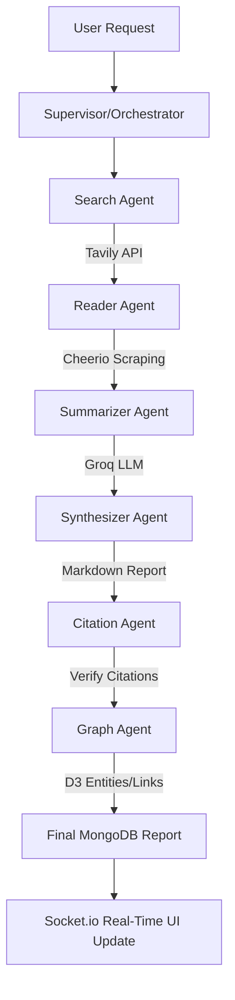

# 💡 Lumen: Multi-Agent AI Research Assistant

Lumen is an advanced, premium AI-powered research platform built on a MERN (MongoDB, Express, React, Node.js) stack. It orchestrates a cooperative team of specialized AI agents to perform real-time web search, content scraping, text summarization, multi-source synthesis, citation validation, and interactive knowledge graph construction.

The platform provides a highly responsive UI with real-time feedback using WebSockets (Socket.io) to stream agent activity logs, and showcases synthesized research findings alongside a dynamic, interactive D3-based concept graph.

---

---

---

## 🚀 Key Features

* **AI Agent Orchestration:** Coordinates 6 specialized agents working together under a central supervisor to fetch, analyze, and build research reports.
* **Research Depth Settings:** Choose between **Quick**, **Standard**, or **Deep** research mode, which dynamically alters Tavily search complexity (basic vs. advanced), result count (4, 8, or 15 sources), LLM output tokens (1000, 2000, or 4000), and report layout complexity.
* **Real-Time Progress Tracking:** Watch agents execute tasks (searching, reading, summarizing) in real-time through a terminal-style progress log powered by Socket.io.
* **Smart Citation Verification:** Verifies citations by cross-referencing generated content against the source text to ensure validity and prevent AI hallucinations.
* **Dynamic Knowledge Graph:** Automatically extracts key entities (concepts, organizations, people, events, sources) and relationship links, rendering them in a force-directed interactive D3.js visualization. It features centering gravity forces and boundary constraints to keep separate clusters centered and visible.
* **Premium Mobile-First UI:** Designed with modern aesthetics including glassmorphic elements, glowing gradient accents, smooth micro-animations, and a fully responsive sidebar overlay with a click-away backdrop on mobile viewports.
* **Session Management:** Save and access historical research sessions with dedicated routes for individual session results.
* **Secure Authentication:** Complete registration and login system backed by JWT (JSON Web Tokens) with secure HttpOnly cookie storage.

---

## 🛠 Tech Stack

### Frontend
* **Core:** React 19, Vite, React Router DOM v7
* **State Management:** Zustand (lightweight, reactive global store)
* **Styling:** Tailwind CSS v4 (using the `@tailwindcss/vite` compiler)
* **Visualizations:** D3.js (Force-directed graph layout)
* **Content Rendering:** React Markdown for reading rich reports

### Backend
* **Runtime & Framework:** Node.js, Express v5
* **Database:** MongoDB & Mongoose (Object Data Modeling)
* **Real-Time Communication:** Socket.io (WebSockets)
* **Search Infrastructure:** Tavily Search API
* **AI Engine:** Groq SDK (utilizing `llama-3.1-8b-instant` and other Groq-hosted models)
* **Scraping Engine:** Cheerio & Axios (for scraping full text from search results)
* **Testing:** Jest (unit testing suite for agents)

---

## 🤖 Multi-Agent Architecture

Lumen utilizes a sequential workflow coordinated by the **Orchestrator** (Supervisor):



1. **Search Agent:** Queries the Tavily API to locate relevant web results, scaling the result counts (4, 8, or 15) and search depth (basic/advanced) dynamically based on the selected research depth.
2. **Reader Agent:** Concurrently scrapes full-page HTML content from the returned URLs and extracts clean text.
3. **Summarizer Agent:** Condenses scraped articles into concise summary bullet points using Groq.
4. **Synthesizer Agent:** Generates a comprehensive research report in Markdown, tailoring the sections, word count target (300-500, 800-1200, or 1500-2500 words), and max tokens based on the selected research depth.
5. **Citation Agent:** Validates that the facts presented correspond directly to the source URLs, filtering out invalid citations.
6. **Graph Agent:** Extracts the top 10–15 key entities (concepts, persons, organizations, events, sources) and their relationships to construct the knowledge graph.

---

## 📂 Project Structure

```
Lumen/
├── backend/
│   ├── src/
│   │   ├── agents/          # Agent logic (search, reader, summarizer, etc.)
│   │   ├── config/          # DB connection configuration
│   │   ├── controllers/     # Route controllers (Auth, Research sessions)
│   │   ├── middleware/      # Auth & protect middlewares
│   │   ├── models/          # Mongoose Schemas (User, Session, Report, etc.)
│   │   ├── routes/          # Express Routers
│   │   ├── services/        # Socket.io, Agent logging helper
│   │   └── test/            # Jest Unit tests
│   ├── server.js            # Server entrypoint
│   └── package.json
│
├── frontend/
│   ├── src/
│   │   ├── assets/          # Static assets & icons
│   │   ├── components/      # UI components (AgentProgress, KnowledgeGraph, etc.)
│   │   ├── hooks/           # React hooks
│   │   ├── pages/           # Page views (Home, Login, Register, Results)
│   │   ├── services/        # API and Socket communication setup
│   │   ├── store/           # Zustand state stores (auth, research)
│   │   ├── App.jsx          # Route configuration
│   │   └── main.jsx         # App entrypoint
│   ├── vite.config.js       # Vite bundler configuration
│   └── package.json
└── README.md
```

---

## ⚙️ Environment Setup

You need to create configuration files in both the frontend and backend folders.

### 1. Backend Configuration
Create a `.env` file in the `/backend` directory:

```env
MONGO_URI=your_mongodb_connection_string
JWT_SECRET=your_jwt_signing_secret
JWT_REFRESH_SECRET=your_jwt_refresh_secret
CLIENT_URL=http://localhost:5173
TAVILY_API_KEY=your_tavily_api_key
GROQ_API_KEY=your_groq_api_key
```

### 2. Frontend Configuration
Create a `.env.local` file in the `/frontend` directory:

```env
VITE_API_URL=http://localhost:3000/api
VITE_SOCKET_URL=http://localhost:3000
```

---

## ⚡ Installation & Execution

Ensure you have [Node.js](https://nodejs.org/) installed (v18+ recommended) and a running MongoDB database.

### 1. Backend Setup
```bash
cd backend
npm install
npm run dev
```
The backend server runs on `http://localhost:3000`.

### 2. Frontend Setup
```bash
cd frontend
npm install
npm run dev
```
The frontend dev server runs on `http://localhost:5173` (or the next available port).

---

## 🧪 Running Tests

Lumen includes unit tests for agent behaviors utilizing Jest. To run the backend tests:

```bash
cd backend
npm run test
```

For test coverage reports:
```bash
npm run test:coverage
```

---

## 📄 License

This project is licensed under the MIT License - see the [LICENSE](LICENSE) file for details.
